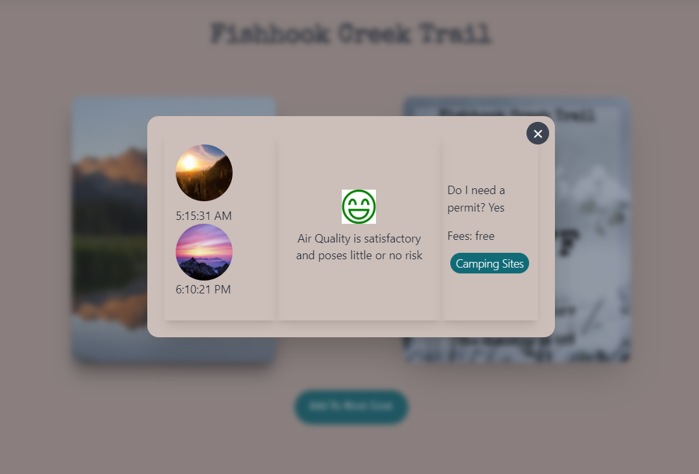

# What is Off The Beaten Path?

Off The Beaten Path is an application aimed at offering a social network for hiking lovers and a place to find new hiking trails to explore. 

## What are the application's functionalities?

* A user can find trails they want to explore by looking at the list of trails or the map of trails

* A user can click search for trails using the search bar or filter by difficulty, length, or elevation gain.

* A user can click on a trail to view more details

* A user can click on "Read More" to view sunrise and sunset times, air quality, and if you need a permit 

* A user can click on the "camping sites" button to view the camping site(s) nearest to the trail

* A user can add trails to their wish list and view their list

* A user can add a trail from their wish list to their completed list and view their completed list of trails.

* A user can review a trail they completed 

* A user can view everyone's posts

* A user can click on the bell icon to message other users

* A user can view their own profile, update their profile, and click on "Your reviews" to see the posts the user has made

* A user can view other people's profile

* A user can click on another user's profile to view their wish list, completed list and their reviews

## Installations

* https://daisyui.com/docs/install/
* https://tailwindcss.com/